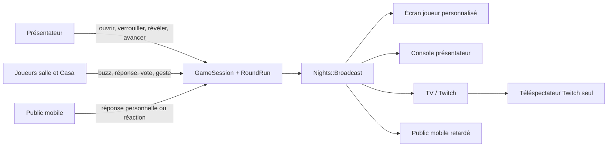
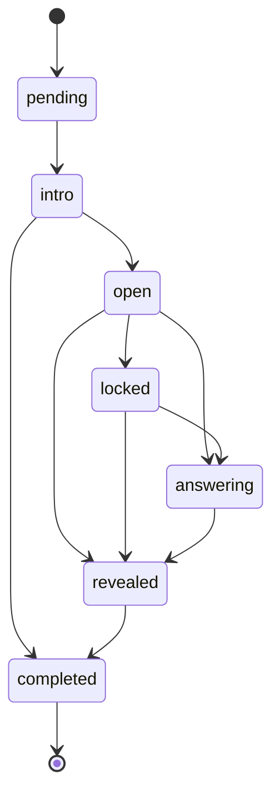
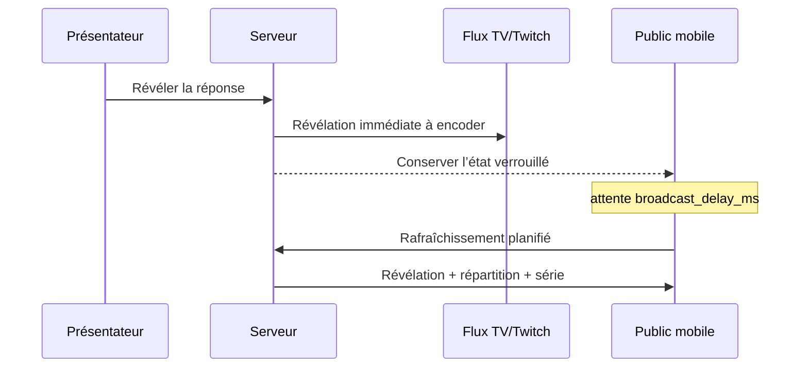

# Noche Live — fonctionnement du système Live

**Statut :** documentation fonctionnelle et technique  
**Date :** 28 août 2026  
**Périmètre :** soirée Live, joueurs salle et maison, présentateur, TV/Twitch et Public interactif

Ce document décrit le système tel qu’il est implémenté. Il ne constitue plus la
cible produit. La nouvelle architecture sans présentateur est définie dans
[`NOCHE_LIVE_HOST_PLAYER_WATCH_REFACTOR.md`](NOCHE_LIVE_HOST_PLAYER_WATCH_REFACTOR.md).
L’ancien plan game-show reste archivé dans
[`NOCHE_LIVE_REFONTE_COMPLETE.md`](NOCHE_LIVE_REFONTE_COMPLETE.md) pour expliquer
l’origine du code actuel.

---

## 1. Résumé en une minute

Une soirée Noche Live est une `GameSession` contenant des équipes, des
participants et une suite ordonnée de manches (`RoundRun`). Le présentateur est
la seule autorité qui fait évoluer la scène commune. À chaque changement, le
serveur redessine en temps réel quatre interfaces adaptées au rôle qui la
regarde :

| Interface | Rôle | Ce qu’elle privilégie |
|---|---|---|
| Joueur salle | Contrôleur physique ou vocal | Une action immédiate, très peu de texte |
| Joueur Casa | Joueur distant | Le contexte complet et une action autonome |
| Présentateur | Régie de la soirée | Une seule prochaine action principale |
| TV / Twitch | Spectacle partagé | Enjeu, timer, scores, révélations et cérémonie |
| Public mobile | Compagnon facultatif | Répondre, attendre sans spoiler, comparer, réagir |

Le téléphone contrôle, la TV raconte et le présentateur donne le rythme. Le
Public n’est ni une équipe ni un joueur Casa : ses réponses ne modifient jamais
le score officiel.

---

## 2. Vue d’ensemble



Tous les écrans partent du même état serveur. Ils ne reçoivent toutefois pas le
même niveau d’information :

- la salle reçoit un contrôleur minimal ;
- Casa reçoit le contexte nécessaire pour jouer seul ;
- le présentateur reçoit les commandes et le desk de contrôle ;
- la TV reçoit la narration broadcast-safe ;
- le Public reçoit une photographie retardée lorsque Twitch introduit de la
  latence.

---

## 3. Les objets principaux

### 3.1 `GameSession` — la soirée

Une soirée stocke notamment :

- la paroisse (`ward`) ;
- le thème et son titre ;
- l’heure prévue ;
- son état : `lobby`, `playing`, `paused` ou `finished` ;
- ses équipes, participants et manches ;
- un identifiant historique `code` utilisé dans certaines routes techniques ;
- un `public_token` aléatoire utilisé par le lien Public ;
- `broadcast_delay_ms`, le décalage appliqué au compagnon Public ;
- l’appareil autorisé à tenir la console présentateur.

Le code de session existe encore pour la compatibilité des URL et des anciens
liens. Il n’est plus une étape normale de l’expérience et n’est pas affiché dans
le lobby, la console ou la TV.

### 3.2 `RoundRun` — une manche exécutée

Le YAML décrit la règle de jeu ; le `RoundRun` décrit son exécution pendant une
soirée. Il conserve la position, la phase, les horaires d’ouverture,
verrouillage et révélation, ainsi que les buzz, réponses et événements de score.



Signification des phases :

| Phase | Signification visible |
|---|---|
| `pending` | Manche pas encore présentée |
| `intro` | Nouvelle scène et nouvel enjeu |
| `open` | Action ou réponses acceptées |
| `locked` | Fenêtre fermée, suspense conservé |
| `answering` | Une équipe répond après un buzz |
| `revealed` | Vérité et résultat visibles |
| `completed` | Manche terminée, passage à la suivante |

Les transitions sont validées côté modèle. Un écran ne peut donc pas faire
passer arbitrairement une manche d’un état à un autre.

### 3.3 Joueurs, équipes et Public

- Un `Player` est un participant de la soirée, éventuellement relié à une
  `Person` persistante.
- Un joueur possède une localisation `room` ou `remote`.
- Un participant appartient à une `Team` via `TeamMembership`.
- Une `AudienceResponse` est une réponse Public personnelle pour une manche.
- Une `AudienceReaction` est une réaction Public temporaire.

Le Public direct ne crée pas de ligne `Player`. Son identité locale est séparée
du système de joueur et ne lui attribue ni équipe, ni XP, ni score.

---

## 4. Entrer dans la soirée sans friction

### 4.1 Joueur reconnu

Le navigateur conserve un identifiant d’appareil signé. Si une personne de la
paroisse est déjà connue sur cet appareil, elle est proposée directement. Après
l’entrée, deux cookies signés retrouvent son `Player` pendant deux jours :

- `noche_player` : identifiant de la ligne joueur ;
- `noche_client` : secret propre à ce joueur.

Un rafraîchissement ou un retour sur le lien renvoie donc directement à la
partie, sans recréer le participant.

### 4.2 Nouveau joueur

Le seul champ indispensable est le prénom. La création d’un profil complet est
facultative. `Players::Join` crée le participant, mémorise l’appareil et appelle
l’attribution automatique d’équipe.

### 4.3 Attribution automatique d’équipe

`Teams::AutoSeat` applique cet ordre :

1. conserver l’équipe de salle déjà associée au joueur ;
2. retrouver l’équipe habituelle de sa personne dans la paroisse ;
3. choisir l’équipe de salle la moins remplie ;
4. créer une équipe de secours si aucune équipe n’existe ;
5. garantir au moins deux sièges opposés lorsque la soirée démarre sans équipes
   paroissiales configurées.

Un joueur Casa reçoit une équipe solo selon la logique dédiée de
`Teams::Seat`. Il ne doit pas être transformé en spectateur faute de place.

### 4.4 Public mobile

Le lien `/public/:public_token` ouvre immédiatement le compagnon. Aucun compte,
code ou choix d’équipe n’est demandé. Un cookie signé `noche_audience` est créé
pour un an. Le serveur ne stocke dans les réponses et réactions que le SHA-256
de ce jeton, jamais le jeton brut.

### 4.5 TV

La route `/s/:session_code/watch` est en lecture seule et n’exige pas de joueur.
Ouvrir la TV ne crée donc pas un faux spectateur dans le roster.

### 4.6 Présentateur

La création d’une soirée redirige directement vers la console. L’accès initial
utilise un jeton secret, puis la console est attachée à l’appareil autorisé.
Une demande depuis un autre appareil doit être accordée, refusée ou bloquée par
le détenteur actuel. Le cookie d’autorisation présentateur expire après un jour.

---

## 5. Déroulement d’une soirée

### 5.1 Création

`Nights::Start` :

1. charge le thème avec `GameDefinition` ;
2. crée la `GameSession` en état `lobby` ;
3. génère les jetons techniques ;
4. instancie un `RoundRun` en `pending` pour chaque manche YAML ;
5. copie les équipes persistantes de la paroisse ;
6. retourne la soirée et son jeton présentateur initial.

### 5.2 Lobby

- Le présentateur voit l’état de la TV, le nombre d’équipes, la salle et Casa.
- Les joueurs voient leur équipe et les personnes déjà présentes.
- Le Public voit une scène d’attente connectée.
- La TV montre l’anticipation de la soirée, sans code ni instructions tactiles.

Le présentateur déclenche `GameSession#start_playing!` pour passer la soirée à
`playing` et placer la première manche en `intro`.

### 5.3 Manche standard

Le conducteur normal est :

1. **Intro** — l’enjeu et l’illustration arrivent sur tous les sièges.
2. **Ouvrir** — `Rounds::Open` accepte les gestes compatibles et démarre le
   timer.
3. **Verrouiller** — `Rounds::Lock` ferme la fenêtre ; la vérité reste cachée.
4. **Révéler** — `Rounds::Reveal` note les réponses, publie le résultat et les
   points.
5. **Scène suivante** — `Rounds::Complete` termine la manche et place la
   suivante en `intro`.

La prochaine action présentateur est calculée depuis la phase. Il n’a pas à
choisir entre plusieurs CTA de même importance. Les joueurs ne possèdent pas de
bouton leur permettant d’avancer la scène commune.

### 5.4 Différents verbes de jeu

La même machine de phases accueille plusieurs mécaniques :

- buzz et réponse d’équipe ;
- QCM ;
- vote ;
- mime ou tabou ;
- chasse d’objet ;
- ordre à reconstruire ;
- rapid tap ;
- pose ou freeze ;
- finale en couches.

La vue joueur choisit le contrôleur adapté à la définition de la manche et à la
localisation `room`/`remote`. Une même manche peut donc demander un geste
collectif dans la salle et proposer une variante autonome à Casa.

### 5.5 Finale

La finale peut conserver en interne l’information qu’une réponse est correcte
pour décider si Casa peut voler la couronne, sans révéler prématurément cette
vérité à l’écran. `Nights::Crown` note les choix, révèle la manche, la termine et
fait passer la soirée à `finished` dans une seule séquence autoritaire.

Le résultat converge ensuite vers la cérémonie : champion, podium et sortie de
la soirée.

---

## 6. Synchronisation temps réel

### 6.1 Source autoritaire

La base de données est la source de vérité. Toute action valide modifie d’abord
les modèles, puis appelle `night.broadcast_state`. Le navigateur ne décide
jamais localement qu’une manche est révélée ou terminée.

### 6.2 Canaux Turbo Streams

Chaque soirée expose des flux distincts :

| Flux | Cible stable | Contenu |
|---|---|---|
| `player_stream(player)` | `#night_play` | Écran personnalisé du joueur |
| `presenter_stream` | `#night_presenter` | Console et desk présentateur |
| `watch_stream` | `#night_watch` | TV/Twitch |
| `audience_stream` | `#night_spectator` | Compagnon Public |

`Nights::Broadcast` recharge la soirée puis :

1. remplace chaque écran joueur dans sa langue ;
2. remplace la TV ;
3. remplace la console présentateur ;
4. demande un rafraîchissement du Public ;
5. publie éventuellement un `pulse` de feedback.

Le rendu est effectué côté serveur. Tous les clients reçoivent ainsi une
représentation cohérente de la même phase, même si leurs interfaces diffèrent.

### 6.3 Pulses, sons et transitions

Un pulse accompagne les événements significatifs : arrivée, ouverture, buzz,
verrouillage, réponse, score, passage à la suite ou réaction. Le partial
`shared/_pulse` choisit l’icône, le libellé et le cue SFX. Le contrôleur Stimulus
`pulse_controller.js` joue le son et retire le feedback après l’animation.

`motion_controller.js` enveloppe les remplacements compatibles dans la View
Transitions API. Si le navigateur ne la supporte pas ou si
`prefers-reduced-motion: reduce` est actif, le remplacement reste instantané et
fonctionnel.

---

## 7. Public interactif et latence Twitch

### 7.1 Pourquoi un état Public séparé

Le serveur peut avoir déjà verrouillé ou révélé une manche alors que le
téléspectateur regarde encore la question quelques secondes plus tôt sur
Twitch. Envoyer l’état brut au compagnon révélerait la réponse avant la vidéo.

`Audience::Snapshot` fabrique donc une phase diffusée à partir des timestamps du
`RoundRun` et de `broadcast_delay_ms`.



Le décalage est réglable entre 0 et 30 000 ms. Il retarde l’ouverture, le
verrouillage et la révélation visibles par le Public. Le timer Public utilise
l’heure de fin plus ce même délai.

### 7.2 Répondre

Une réponse Public est acceptée seulement si :

- la photographie Public est en phase `open` ;
- la manche courante est bien celle demandée ;
- la manche possède des choix ;
- le choix appartient à la liste définie dans le YAML.

L’index unique `(round_run_id, audience_digest)` garantit une seule réponse par
personne et par manche. Le premier choix est immuable, même en cas de double
toucher ou de requêtes concurrentes. Aucun `ScoreEvent` n’est créé.

### 7.3 Réagir

Les réactions disponibles sont `applause`, `heart` et `crown`. Elles sont
acceptées pendant `open`, `locked` et `revealed`, avec une limite d’une réaction
toutes les deux secondes par identité et par manche. Une réaction valide publie
un pulse agrégé vers les écrans Live ; aucun message libre ou nom de spectateur
n’est projeté.

### 7.4 Révélation Public

Une fois la cue diffusée, le compagnon calcule et affiche :

- si la réponse personnelle est correcte ;
- la réponse officielle et sa référence ;
- la répartition en pourcentage des choix Public ;
- le nombre de réponses ;
- la série personnelle de bonnes réponses consécutives ;
- le classement officiel des équipes, qui reste séparé de la participation
  Public.

### 7.5 Reconnexion

Le contrôleur `audience_controller.js` :

- affiche l’état en ligne ou hors ligne ;
- écoute les événements réseau du navigateur ;
- programme un rafraîchissement exactement à la prochaine cue retardée ;
- utilise `Turbo.visit(..., { action: "replace" })` pour rejoindre l’état courant
  sans gonfler l’historique du navigateur.

Après un verrouillage du téléphone ou une courte coupure, l’utilisateur revient
donc sur la phase diffusée actuelle. Une réponse déjà enregistrée est retrouvée
par son `audience_digest`.

---

## 8. Ce que voit chaque siège

### Joueur salle

- HUD compact, équipe et score ;
- scène narrative partagée ;
- gros contrôleur adapté : Buzz, choix, vote, validation physique ;
- verrouillage immédiat après l’action ;
- résultat automatique, sans bouton « Continuer ».

Objectif : remettre les yeux sur les autres, le présentateur et la TV.

### Joueur Casa

- question et contexte complets ;
- variante distante lorsque le geste de salle n’est pas reproductible ;
- réponse autonome ;
- même suspense et même révélation que la soirée ;
- aucun état demandant de confirmer ce que la salle a fait.

### Présentateur

- scène dominante ;
- une action dorée correspondant à la phase ;
- desk secondaire pour réponses et classement ;
- commandes exceptionnelles dans « Plus » ;
- accès direct aux écrans TV et Public ;
- gestion sécurisée du passage de console à un autre appareil.

### TV / Twitch

- composition 16:9 lisible à distance ;
- enjeu, timer et classement ;
- aucun formulaire ni contrôle tactile ;
- pulses, VFX et SFX ;
- révélation hiérarchisée et cérémonie finale.

Une personne derrière Twitch doit pouvoir comprendre le direct sans ouvrir le
compagnon mobile. Le Public interactif enrichit le spectacle, il ne répare pas
une TV incompréhensible.

### Public mobile

- entrée anonyme ;
- question personnelle sur les manches compatibles ;
- état verrouillé vivant ;
- réactions accessibles au pouce ;
- résultat, répartition et série après le délai broadcast ;
- aucun score, XP ou classement public persistant dans le lot 1.

---

## 9. Style, responsive et accessibilité

Les écrans Live utilisent Celestial Dark pour cette soirée : bleu nuit, ivoire,
lumière volumétrique et or réservé à l’action ou à la récompense. L’artwork est
la scène ; les panneaux restent des scrims fonctionnels et non des cartes SaaS.

Principes responsive :

- `100dvh` et safe areas sur téléphone ;
- action principale conservée dans la zone de pouce ;
- composition à deux colonnes en paysage court ;
- colonne de jeu limitée sur tablette et desktop ;
- présentateur : CTA toujours visible, desk en second niveau ;
- TV : grille de score capable d’afficher cinq équipes sans sortir du cadre ;
- Public : réactions secondaires mais toujours atteignables ;
- animations neutralisées par `prefers-reduced-motion`.

Viewports de référence validés : 320×568, 390×844, 430×932, 768×1024,
1024×768, 1280×720, 1440×900, 1920×1080 et 2560×1440, avec contrôle paysage
844×390.

---

## 10. Mode opératoire d’une soirée

### Avant le direct

1. Créer la soirée depuis la paroisse : la console s’ouvre directement.
2. Régler la langue présentateur et le délai Twitch si nécessaire.
3. Ouvrir la TV depuis la console sur l’écran de diffusion.
4. Ouvrir le lien Public et le partager avec le direct.
5. Vérifier dans le lobby : TV, équipes, salle et Casa.
6. Tester un appareil salle, un appareil Casa et un téléphone Public.

### Régler le délai Twitch

`broadcast_delay_ms` doit représenter le retard observé entre l’action réelle et
son apparition sur le flux regardé par le public. Il peut être mis à jour par
l’API d’administration de la soirée. Valeurs acceptées : 0 à 30 000 ms.

Conseil de répétition : filmer une action visuelle nette, mesurer son apparition
sur le flux distant, puis ajouter une petite marge. Refaire la mesure lorsque la
chaîne d’encodage ou la plateforme change.

### Pendant le direct

1. **Comenzar la noche** depuis le lobby.
2. Présenter l’intro de manche.
3. Utiliser l’unique CTA pour ouvrir l’action.
4. Verrouiller lorsque la fenêtre est terminée.
5. Laisser une courte respiration de suspense.
6. Révéler.
7. Vérifier le desk si une validation humaine est nécessaire.
8. Passer à la scène suivante.
9. À la finale, utiliser **Mostrar ganadores** seulement au moment de la
   cérémonie.

### En cas d’incident

| Incident | Comportement attendu / action |
|---|---|
| Téléphone joueur rechargé | Le cookie le renvoie à son joueur et à la manche courante |
| Public hors ligne | L’état hors ligne apparaît ; le retour réseau permet le rafraîchissement |
| Double toucher Public | La première réponse reste la seule enregistrée |
| Réaction répétée | Les réactions dans la fenêtre de deux secondes sont ignorées |
| Public en avance sur Twitch | Augmenter `broadcast_delay_ms` |
| Public trop en retard | Réduire `broadcast_delay_ms` après une répétition mesurée |
| Console ouverte ailleurs | Le détenteur actuel accorde, refuse ou bloque la demande |
| TV rechargée | Elle relit immédiatement la `GameSession` et le `RoundRun` courants |

---

## 11. Sécurité et données

- Les cookies d’identité sont signés, `HttpOnly` et `SameSite=Lax`.
- Le Public est identifié par un jeton aléatoire dont seul le digest est stocké
  avec ses interactions.
- Le `public_token` est unique et difficile à deviner ; la page Public porte
  `noindex,nofollow`.
- Le lien Public donne accès au spectacle et aux interactions Public, jamais aux
  commandes présentateur.
- Les choix Public sont limités aux options serveur et à 80 caractères.
- Les réactions sont limitées à trois marques connues et rate-limitées.
- La console présentateur combine jeton initial, cookie signé et empreinte
  d’appareil.
- Les réponses Public n’écrivent jamais dans les tables de score officiel.

Le lien Public reste un lien partageable : toute personne qui le possède peut
regarder et interagir anonymement. Il ne doit contenir aucune donnée privée.

---

## 12. Cartographie du code

### Domaine

- `app/models/game_session.rb` — soirée, streams et podium ;
- `app/models/round_run.rb` — machine d’état des manches ;
- `app/models/player.rb` — rôle et localisation ;
- `app/models/team.rb` — équipe, score et progression ;
- `app/models/audience_response.rb` — réponse Public ;
- `app/models/audience_reaction.rb` — réaction Public.

### Orchestration

- `app/services/nights/start.rb` — création ;
- `app/services/rounds/open.rb` — ouverture ;
- `app/services/rounds/lock.rb` — verrouillage ;
- `app/services/rounds/reveal.rb` — notation et révélation ;
- `app/services/rounds/complete.rb` — passage à la suivante ;
- `app/services/nights/crown.rb` — finale ;
- `app/services/nights/broadcast.rb` — synchronisation de tous les sièges ;
- `app/services/teams/auto_seat.rb` — équipe automatique ;
- `app/services/players/join.rb` — entrée joueur.

### Public

- `app/controllers/public_controller.rb` — construit l’écran courant ;
- `app/services/audience/snapshot.rb` — phase diffusée et anti-spoiler ;
- `app/services/audience/respond.rb` — réponse unique ;
- `app/services/audience/react.rb` — réaction et rate limit ;
- `app/views/public/_frame.html.erb` — tous les états visuels ;
- `app/javascript/controllers/audience_controller.js` — réseau et reprise.

### Interfaces

- `app/views/play/` — salle et Casa ;
- `app/views/presenter/consoles/` — présentateur ;
- `app/views/watch/` — TV/Twitch ;
- `app/assets/stylesheets/application.css` — tokens, composants, breakpoints et
  motion Live ;
- `app/javascript/controllers/motion_controller.js` — transitions de scènes ;
- `app/javascript/controllers/pulse_controller.js` — feedback et SFX.

---

## 13. Tests de référence

Les comportements structurants sont couverts par :

- `test/integration/night_flow_test.rb` — soirée multi-sièges ;
- `test/services/teams/auto_seat_test.rb` — attribution automatique ;
- `test/services/rounds/*_test.rb` — transitions et finale ;
- `test/services/audience/snapshot_test.rb` — délai Twitch et anti-spoiler ;
- `test/services/audience/respond_test.rb` — réponse unique sans score ;
- `test/services/audience/react_test.rb` — réactions et cadence ;
- `test/controllers/public_controller_test.rb` — écran Public et anonymat ;
- `test/system/night_temple_visual_test.rb` — rendu des sièges Live.

Validation complète de la refonte : **954 tests, 14 878 assertions, 0 échec et
0 erreur**.

---

## 14. Limites actuelles et lot 2

Le lot 1 Public fournit réponse parallèle, réactions, répartition et série
locale. Il n’inclut volontairement pas :

- XP Public persistant ;
- classement global du Public ;
- votes modifiant les règles de la soirée ;
- choix de bonus ou handicap ;
- mini-défis de transition ;
- messages libres projetés sur la TV.

Ces fonctions exigent des décisions supplémentaires de modération,
d’équilibrage et de conduite présentateur. Elles ne doivent pas être ajoutées en
réutilisant le score officiel ou en transformant le Public en équipe implicite.

La validation logicielle ne remplace pas une répétition humaine avec vraie
chaîne Twitch, présentateur, TV et plusieurs téléphones. Le test décisif reste :
après cinq minutes, une personne extérieure doit pouvoir nommer le leader,
l’enjeu courant et la raison d’attendre la prochaine révélation.

---

## 15. Règles pour faire évoluer le système

Avant d’ajouter une manche ou une interaction, écrire les cinq contrats :

```text
SALLE : quel geste physique, vocal ou collectif ?
CASA : comment joue-t-on de manière autonome ?
PRÉSENTATEUR : quelle unique action fait avancer la scène ?
TV : que comprend-on sans téléphone ?
PUBLIC : peut-on répondre, seulement réagir, ou simplement regarder ?
```

Puis vérifier la boucle :

> anticipation → action → suspense → résultat → feedback → récompense → prochaine envie

Une évolution est incomplète si elle ajoute un écran mort, un bouton de
confirmation administratif, une révélation Public anticipée, une commande sur
la TV ou une dépendance au compagnon pour comprendre Twitch.

---

## Documents associés

- [`NOCHE_LIVE_REFONTE_COMPLETE.md`](NOCHE_LIVE_REFONTE_COMPLETE.md) — plan et
  décisions de conception ;
- [`GAME_PACING.md`](GAME_PACING.md) — rythme des manches ;
- [`REMOTE_PLAY.md`](REMOTE_PLAY.md) — exigences Casa ;
- [`AGENT_REVIEWS/118-noche-live-five-seats-public.md`](AGENT_REVIEWS/118-noche-live-five-seats-public.md)
  — revue finale des cinq sièges.
